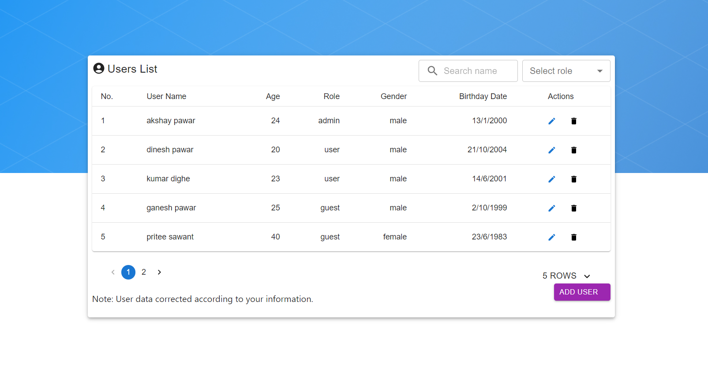

# User Dashboard

#### React Js Projrct  
This project was generated with [React Js](https://react.dev/learn/start-a-new-react-project) version 18.2.0

### Features:

1. **User Registration**: Register as a new user with basic information such as name, age, birthday, role, gender, email, and password.
2. **User Login**: Authenticate users with email and password credentials.
3. **View All Users**: Admin can view a list of all registered users.
4. **Update User Profile**: Update user profile information including name, age, birthday, role, gender, email, and password.
5. **Delete User**: Admin can delete a user from the system.

### Technologies Used

1. **Frontend**: React.js, Material-UI for UI components, Redux, React Router for navigation.
2. **Backend**: Node.js, Express.js for server-side application, MongoDB as the database using Mongoose for data modeling.
3. **State Management**: Redux for managing application state.
4. **Authentication**: JSON Web Tokens (JWT) for user authentication.
5. **Form Handling**: React Hook Form for handling form validations and submissions.
6. **API Communication**: Axios for making API requests from the frontend to the backend.

## Getting Started

### Installation

#### Begin with the initial setup process:

1. First, clone our project repository into your folder.

#### cmd

```javascript
git clone https://github.com/AkshayPawar1312000/user-dashboard.git
```

2. Open the project folder in Visual Studio Code editor.

3. Next, open a new terminal and navigate to the user-client-side folder

#### cmd

```javascript
cd user-client-side
```

4. Next, open a new terminal and navigate to the user-server-side folder. 

#### cmd

```javascript
cd user-server-side
```
5. Then, run the npm install command in both terminals. 

#### cmd

```javascript
npm install
```

6. Next, run the `npm start` command in both terminals to start both sides. 

#### cmd

```javascript
npm start
```

#### You will get such a result:

1. You can add all the fields according to your user data, and all fields are required.


2. If the user already exists, please log in instead.


2. Now you can view user data based on your information.


### Conclusion

The User Dashboard Web Application provides a secure and scalable solution for managing user data with features like user management, secure authentication, and a responsive dashboard. Built on Node.js and MongoDB, it ensures high performance and scalability as your user base. Start using it today to streamline user management and enhance operational efficiency.